# Background:
Our second survey released late February, covering the topics of technology and media. There was also a special section with questions from LASACS, but those will not be reviewed in this post. The survey received 120 responses, which was slightly less than our first post.

# Sample
The responses were skewed towards younger students. Sophomores were the most overrepresented group by far. In fact, there was a significant 13.5% difference between the actual representation and recorded responses for sophomores. Freshmen were the most accurately represented group, with there only being a 0.6% difference. Seniors were once again the most underrepresented (even more than last time).

| Grade         | Actual % | Recorded % | % pt. Difference |
|---------------|----------|------------|------------------|
| 9             | 30.2%    | 30.8%      | +0.6%            |
| 10            | 27.1%    | 40%        | +13.5%           |
| 11            | 20.4%    | 18.3%      | -2.1%            |
| 12            | 22.2%     | 10.8%        | -11.4%           |
 

# Social Media
The vast majority of students used social media.
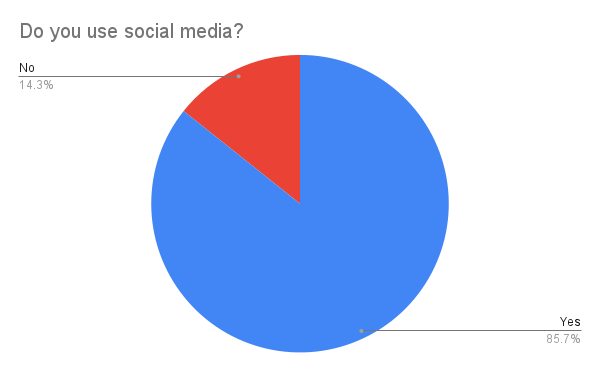

The most used social media platforms among students were Youtube, Discord, and Instagram. Snapchat, TikTok, Reddit, and Twitch followed with roughly equal numbers of students using them.
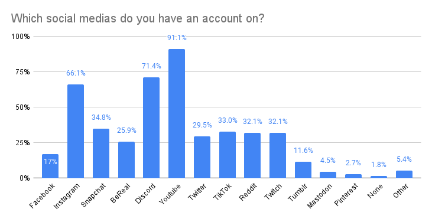

Instagram and Discord were by far the most posted on social media apps. BeReal and Snapchat followed in a distant 3rd and 4th.

Students regularly viewed posts from Youtube, Discord, and Instagram. These platforms also contested each other for the platform students viewed posts from the MOST.
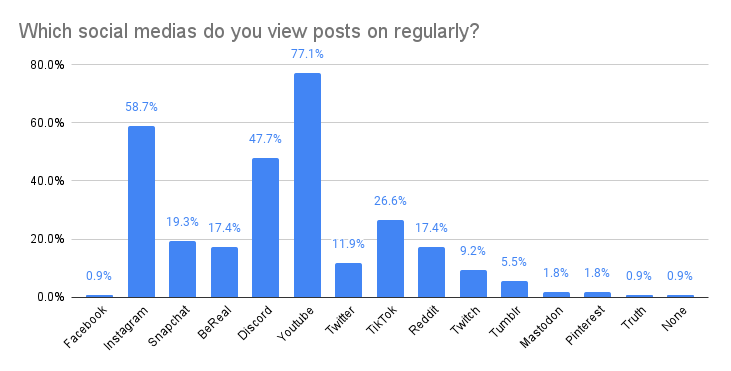

# Technology
The vast majority of students own Apple phones, with Samsung being placed in a distant second.
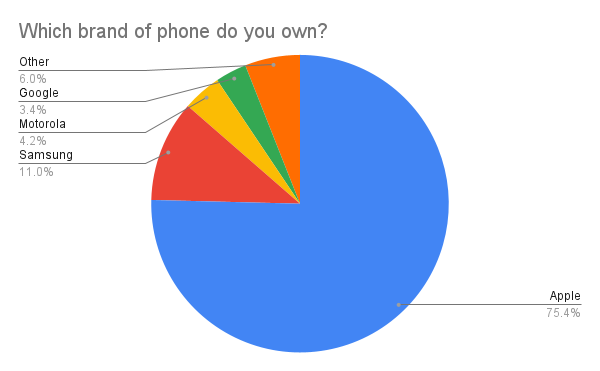

Most students have phones that are 3 years old, followed by 2, 4, and 1.
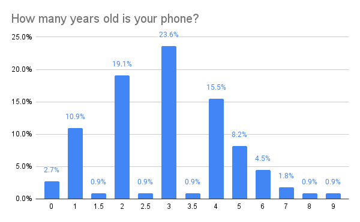

Most students have owned their phones for two years, followed by those who have owned their phones for less than a year and for only 1 year.
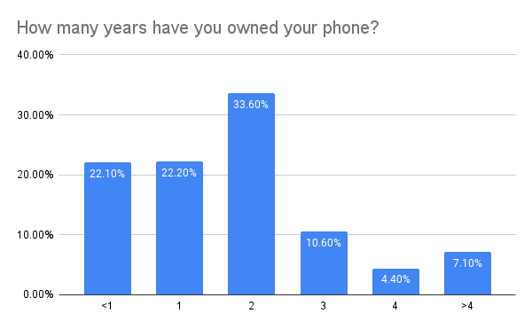

The vast majority of students use iOS, which is by no means surprising considering the vast majority of students own iPhones. Android is a distant second (which is not a surprise). The variation in percentages between iPhone users and iOS years is due to the fact that two less people answered this question.
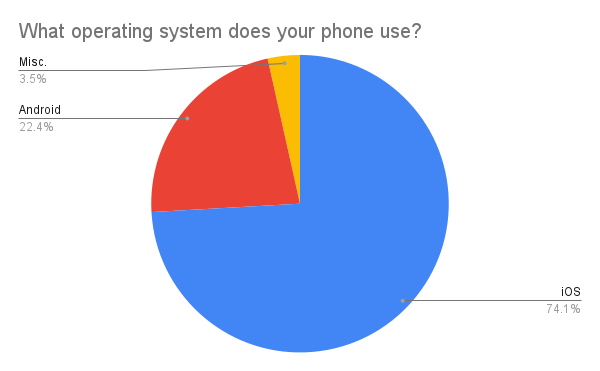

A smaller percentage of users prefer iOS or Android than those who use it. This is due to the fact that many people had no preference, or were uncertain due to limited experience with the other OS.

People typically own one to two laptops, and very few have three to four.
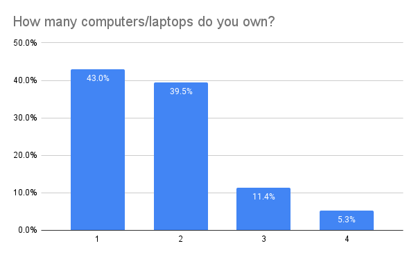

Most people have Windows or ChromeOS (which is no surprise because Windows is the most popular operating system and the school provides free chromebooks to students). A significant number used MacOS, and very few people used Linux.
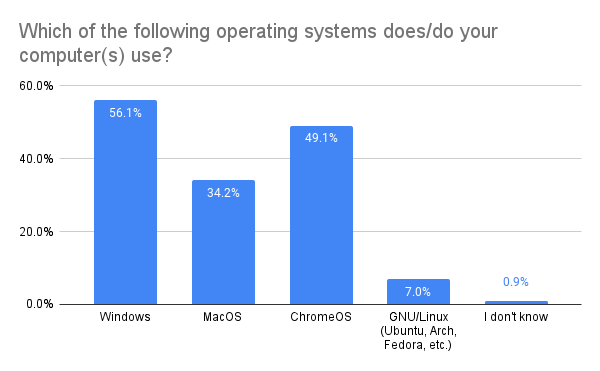

People overwhelmingly use Google as their default search engine (which is no surprise). DuckDuckGo is a distant second, and Bing is a distant third.
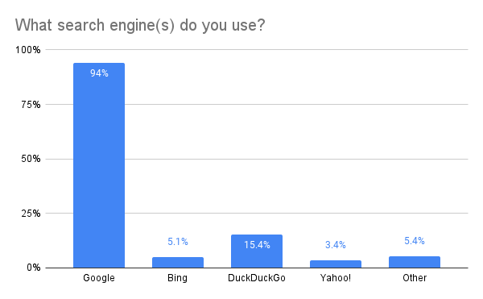

People tend to use Chrome as their browser, but many also use Safari. This is to be expected due to the significant number of MacOS users.
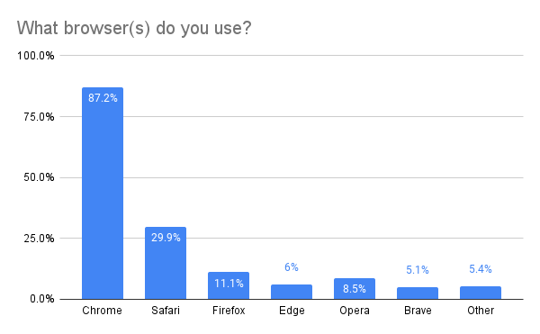

Most students took zero photos per day, with the number of students who took a given number of photos declining as that number went up.

Most students did not own an external camera, preferring to opt for their phone. This indicates just how much smartphone cameras have improved in recent years.

The streaming services varied significantly, but the heavy hitters were Netflix, Disney+, and Prime Video. Hulu and HBO Max also had a decent number of users, and were basically tied with each other.
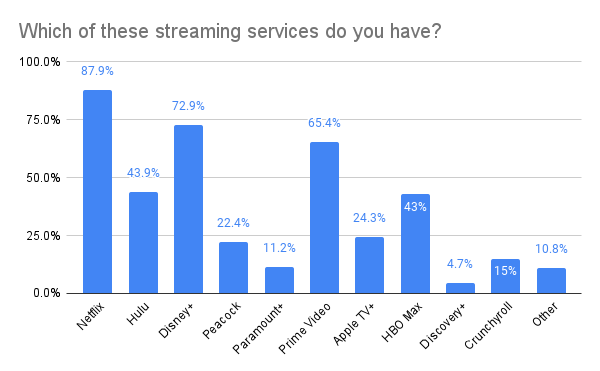

Roughly a half of students used Netflix the most, with the other half being split between services such as Disney+, Hulu, and Prime Video.
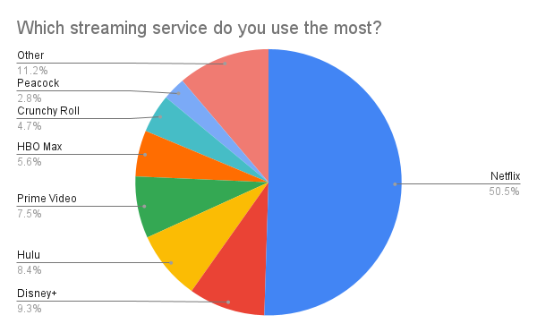

Roughly a quarter of students viewed Netflix and Disney+ as having the best value for money––followed by Prime Video, HBO Max, and Hulu. A few people mentioned piracy or 123movies as having the best value, which is technically true ¯\\_(ツ)_/¯. Piracy was also mentioned for the other questions involving streaming services.

# Conclusion
Our survey skewed drastically towards sophomores and once again underrepresented seniors. Freshman and juniors were more accurately represented. However, it still provided some insight into LASA students and their media habits. In the future, we hope to get our survey out to an even larger audience (especially upperclassmen) that is more representative of the LASA student body.